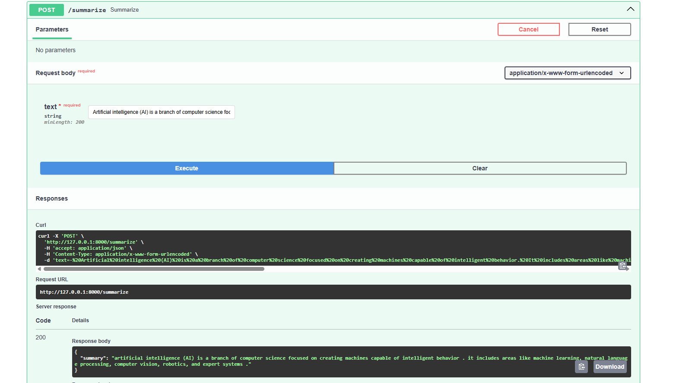

# Text Summarization
FastAPI + LangChain + Hugging Face based summarization service.

### Model: 
- `t5-base`


## Installation

### 1. Build the Docker Image

```bash
docker build -t text-summarization .
```

### 2. Run the Container

```bash
docker run -p 8000:8000 text-summarization
```


## API 

Swagger UI - http://localhost:8000/docs

Check the file `example_texts.txt` for sample texts to use 